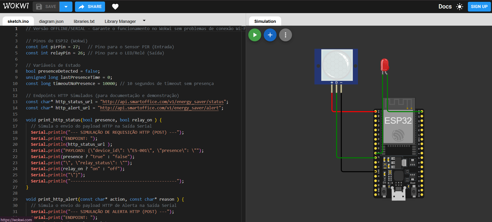

# GLOBAL SOLUTIONS 2025 (GS) – O FUTURO DO TRABALHO

## Integrantes do Grupo

*  Camila do Prado Padalino - RM98316
*  Gabriel Teixeira Machado - RM551570
*  Guilherme Brazioli - RM98237

## Projeto: Smart Energy Saver (SES) - Otimização Energética em Ambientes de Trabalho

> Link pro projeto no Wokwi: **https://wokwi.com/projects/448236584108312577**  
> Link para o vídeo no Youtube:

### 1. Descrição do Problema e Solução

#### Problema Abordado
O **desperdício de energia** em ambientes de trabalho (escritórios, salas de reunião, estações de trabalho) é um desafio significativo no contexto do futuro do trabalho e da sustentabilidade. O esquecimento de desligar equipamentos (monitores, luzes, carregadores) após o uso contribui diretamente para o aumento dos custos operacionais e para um maior **impacto ambiental**.

#### Solução Proposta
O **Smart Energy Saver (SES)** é uma solução de Internet das Coisas (IoT) que se alinha ao tema **"Economia verde e sustentabilidade"** ao otimizar o consumo energético em espaços de trabalho.

O sistema utiliza um microcontrolador **ESP32** e um **Sensor de Movimento PIR** para monitorar a presença no ambiente. A lógica é simples e eficaz:
*   **Presença Detectada:** O dispositivo conectado (simulado por um LED/Relé) é ativado.
*   **Ausência Prolongada:** Se o sensor não detectar movimento por um período configurável (10 segundos na simulação), o dispositivo é **desligado automaticamente**, gerando economia de energia.

Para fins de demonstração em ambiente de simulação (Wokwi), a comunicação de status e alertas é **simulada** e impressa na Saída Serial, comprovando o formato de comunicação **HTTP** que seria utilizado em um cenário real.

### 2. Desenvolvimento Técnico

#### Componentes (Simulação Wokwi)
| Componente | Função | Conexão (Pino ESP32) |
| :--- | :--- | :--- |
| **ESP32 Dev Kit C V4** | Microcontrolador | - |
| **Sensor PIR** | Detecção de presença (Entrada) | **GPIO 27** |
| **LED ** | Simula o dispositivo controlado (Saída) | **GPIO 26** |

#### Dependências de Software
O projeto foi desenvolvido utilizando a **Arduino IDE** para o ESP32. Esta versão é **OFFLINE** e não requer bibliotecas de rede (`WiFi.h`, `HTTPClient.h` ou `PubSubClient.h`), garantindo o funcionamento imediato no Wokwi.

### 3. Instruções de Uso e Simulação

#### Simulação no Wokwi
1.  Acesse o link do projeto no Wokwi: **https://wokwi.com/projects/448236584108312577**
2.  Clique em **"Start Simulation"**.
3.  Abra a **Saída Serial** (Serial Monitor) para visualizar as mensagens de status e a simulação da comunicação HTTP.
4.  Para simular a presença, clique no **Sensor PIR** no diagrama e arraste o *slider* para a posição **HIGH** (Presença). O LED deve acender.
5.  Para simular a ausência, mova o *slider* para **LOW**. Após 10 segundos, o LED deve apagar, e a Saída Serial mostrará o alerta de economia.

### 4. Explicação sobre a Comunicação HTTP (Simulada)

O sistema SES utiliza o protocolo **HTTP (Hypertext Transfer Protocol)** para comunicação. Na simulação, a troca de dados é comprovada pela impressão dos payloads na Saída Serial, conforme o formato JSON esperado.

| Endpoint (Simulado) | Método | Descrição | Exemplo de Payload (JSON) |
| :--- | :--- | :--- | :--- |
| `http://api.smartoffice.com/v1/energy_saver/status` | **POST** | Envia o status atual do dispositivo (presença e relé) a cada 5 segundos. | `{"device_id": "ES-001", "presence": "true", "relay_status": "on"}` |
| `http://api.smartoffice.com/v1/energy_saver/alert` | **POST** | Envia alertas de eventos importantes, como o desligamento automático por economia. | `{"device_id": "ES-001", "action": "power_off", "reason": "no_presence"}` |

**Lógica de Comunicação:**
*   **`presence`:** Indica se o Sensor PIR está detectando movimento (`true` ou `false`).
*   **`relay_status`:** Indica se o dispositivo conectado (LED/Relé) está ligado (`on`) ou desligado (`off`).
*   **`action: "power_off"`:** Alerta específico que demonstra a funcionalidade de economia de energia.

### 5. Arquivos-Fonte

O código-fonte completo e comentado está disponível no arquivo `main.ino`.

